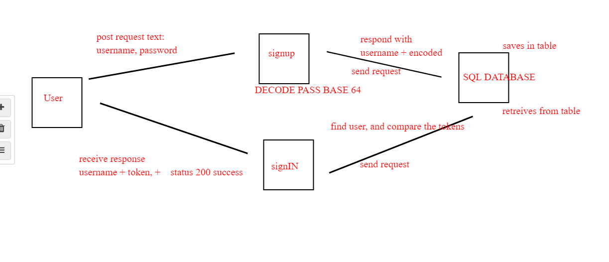

PULL REQUEST: https://github.com/yazanbaker94/basic-auth/pull/1

DEPLOYED VERSION ON HEROKU: https://basic-auth-yazann.herokuapp.com/signup

How do I install the app or library?

Clone repo on your local machine
Open terminal, run npm i
Run your postgress server
Create a database called 'testing'
Change the postgress url to /testing
Create an .env file and add your PORT='PORTNUMBER' to run the server on
Run ThunderBird, add a POST request localhost:PORT/signup with username and password, have it saved in the SQL DB locally.

After that, go /signin using thunderbird POST, but use the AUTH section and enter the username and password, and let the request compare your user/pass with the ones saved locally.

How do I test the app or library? 
cd into the directory, run npm test, you will see both tests for signin/signup pass

